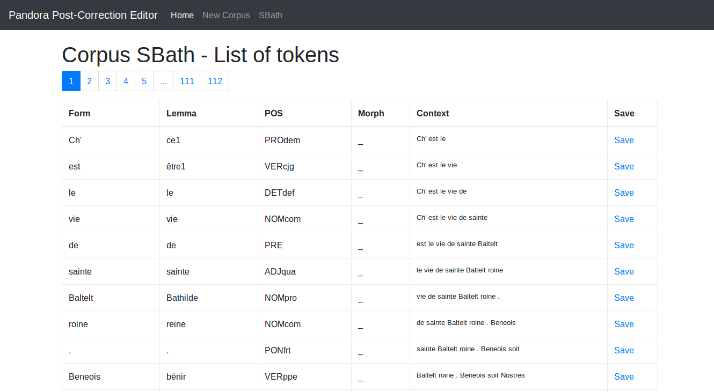

Pandora TAB Post-correction App
===============================================



## Install

Create a virtual environment, source it and run

```bash
pip install -r requirements.txt
python manager.py create_db
```

## Run

```bash
pip install -r requirements.txt
python manager.py run
```

## ToDo

- [x] Create a corpus
- [x] Load a Tab file into a Corpus
- [x] Edit a single token data
- [x] Export to a tab file again
- [x] Track changes
- [ ] Show history
- [ ] Find item with similar structure as corrected one and auto-edit them after approval
- [ ] Add Tokens after corpus creation
- [ ] Register allowed lemmas
- [ ] Check for unallowed lemma
- [ ] Register allowed POS
- [ ] Check for unallowed POS
- [ ] Register allowed Morph
- [ ] Check for unallowed morph

## Source

This app is wished to be simple and local at the moment (No User system). But to keep in the abilities to extend and use
other systems, we based some of our decisions on https://github.com/hack4impact/flask-base/ and the general structure is following theirs.