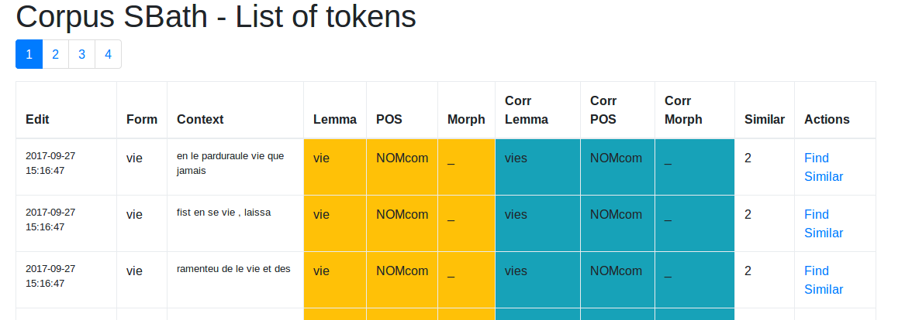
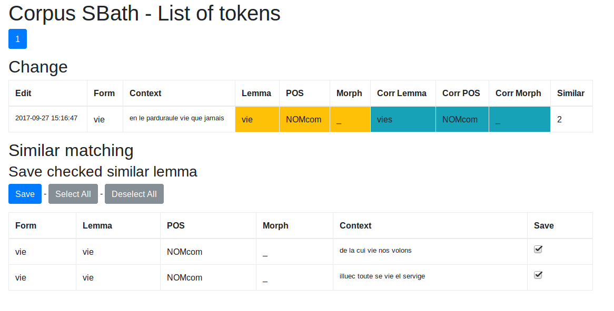

Pandora TAB Post-correction App
===============================================






## Install

Start by cloning the repository, and moving inside the created folder

```bash
git clone https://github.com/hipster-philology/pandora-postcorrect-app.git
cd pandora-postcorrect-app/
```

Create a virtual environment, source it and run

```bash
pip install -r requirements.txt
python manage.py create_db
```

## Run

```bash
python manage.py run
```

## ToDo

- [x] Create a corpus
- [x] Load a Tab file into a Corpus
- [x] Edit a single token data
- [x] Export to a tab file again
- [x] Track changes
- [x] Show history
- [x] Find item with similar structure as corrected one and auto-edit them after approval
- [ ] Add Tokens after corpus creation
- [x] Register allowed lemmas
- [x] Check for unallowed lemma
- [x] Register allowed POS
- [x] Check for unallowed POS
- [ ] Register allowed Morph
- [ ] Check for unallowed morph

## How to contribute

- See [Contribute.md](contribute.md)

## Source

This app is wished to be simple and local at the moment (No User system). But to keep in the abilities to extend and use
other systems, we based some of our decisions on https://github.com/hack4impact/flask-base/ and the general structure is following theirs.
