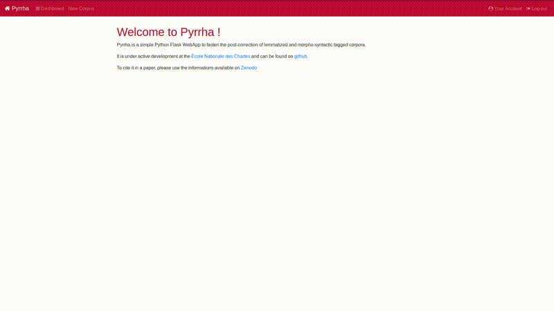

Pyrrha
======

[](https://coveralls.io/github/hipster-philology/pyrrha?branch=master)
[](https://travis-ci.org/hipster-philology/pyrrha)
[](https://doi.org/10.5281/zenodo.2325427)


Pyrrha is a simple Python Flask WebApp to fasten the post-correction
of lemmatized and morpho-syntactic tagged corpora.

# How to cite

This web application and its maintenance is done by Julien Pilla (@MrGecko) and Thibault Clérice (@ponteineptique). As software is research
please cite the software if you use it using the following informations:

```latex
@software{thibault_clerice_2019_3524771,
  author       = {Clérice, Thibault and Pilla, Julien and Camps, Jean-Baptiste and Jolivet, Vincent and Pinche, Ariane},
  title        = {Pyrrha, A language independant post correction app for POS and lemmatization},
  month        = nov,
  year         = 2019,
  publisher    = {Zenodo},
  version      = {Any Version},
  doi          = {10.5281/zenodo.2325427},
  url          = {https://doi.org/10.5281/zenodo.2325427}
}
```

# Credits

This software is built as an addition to the tagger Pie by Enrique Manjavacas (@emanjavacas) and Mike Kestemont (@mikekestemont) [](https://zenodo.org/badge/latestdoi/131014015)
It can connect to lemmatization service like [Deucalion](https://github.com/chartes/deucalion-chartes).

## Demo


## Install

Start by cloning the repository, and moving inside the created folder

```bash
git clone https://github.com/hipster-philology/pyrrha.git
cd pyrrha/
```

Create a virtual environment, source it and run

```bash
pip install -r requirements.txt
python manage.py db-create
```

## Run

```bash
python manage.py run
```

### Creating a new user locally

1. Run the application
2. Click register and register. Remember to note the user email you register with.
3. Stop the application
4. Run `python manage.py edit-user [EMAIL] --confirm-mail --role Administrator` or simply 
`python manage.py edit-user [EMAIL] --confirm-mail` if you don't want administrator role. Replace `[EMAIL]`
with the mail you used. If you are simply running it for yourself, we would definitely recommend to use the Administrator role though.
5. Run the application, login and enjoy !

## How to contribute

- See [Contribute.md](CONTRIBUTING.md)

## Maintainers

- [Julien Pilla](https://github.com/MrGecko)
- [Thibault Clérice](https://github.com/ponteineptique)

## Contributors

-[Jean-Baptiste Camps](https://github.com/Jean-Baptiste-Camps)
-[ngawangtrinley](https://github.com/ngawangtrinley)
-[FrFerry](https://github.com/FrFerry)
-[Vincent Jolivet](https://github.com/architexte)
-[Ariane Pinche](https://github.com/ArianePinche)
-[saisiddhant12](https://github.com/saisiddhant12)
-[jhrdt](https://github.com/jhrdt)
-[AdityaJ7](https://github.com/AdityaJ7)

## Source

This app is wished to be simple and local at the moment (No User system). But to keep in the abilities to extend and use
other systems, we based some of our decisions on https://github.com/hack4impact/flask-base/ and the general structure is following theirs.
