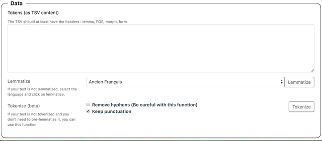
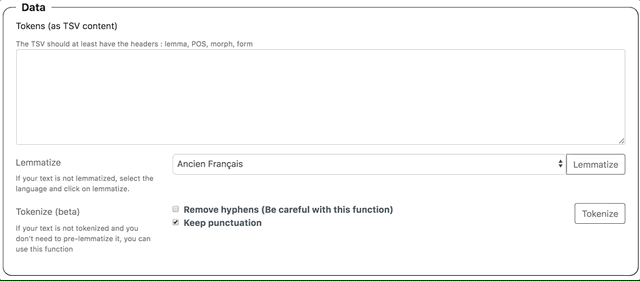
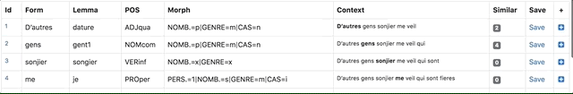

Pyrrha, tutoriel
===

Pyrrha est une application de correction collaborative de l’étiquetage linguistique (lemmatisation et étiquetage morpho-syntaxique – *POS tagging*).

Selon la configuration déployée, Pyrrha permet la lemmatisation préalable   du texte brut soumis.  
Vous pouvez tester une telle configuration de Pyrrha sur le serveur de développement de l’École des chartes : https://dev.chartes.psl.eu/pyrrha/.

**Avertissement**. Il s’agit d’une instance de développement : la sauvegarde des données n’est pas garantie.


### Scénario d’usage

1. [Créer un nouveau corpus](#create_corpus) : un utilisateur crée un corpus à corriger.
1. [Gérer le travail collaboratif](#collaborate) : cet utilisateur peut inviter d’autres utilisateurs à collaborer à la correction du corpus.
1. [Corriger l’annotation](#tags_correct).
1. [Exporter les données corrigées](#export).


---
## 1. Gérer son compte utilisateur

### 1.1. Créer son compte

Lien [`Register`](https://dev.chartes.psl.eu/pyrrha/account/register)

1. Renseigner le formulaire.
1. Confirmer l'inscription en cliquant sur le lien reçu dans sa messagerie.

### 1.2. Modifier son compte

- Onglet `Your Account`  
- Possibilité de mettre à jour l'adresse mail et le mot de passe.

### 1.3. Supprimer son compte

TODO

---
##  2. Gérer ses corpus

### <a name="create_corpus"></a>2.1. Créer un corpus

- Onglet [`New Corpus`](https://dev.chartes.psl.eu/pyrrha/corpus/new)  
- Un *nouveau corpus* est un texte étiqueté que l’on souhaite corriger.  
- À sa création, il convient donc de lui [associer les ressources (listes de contrôle)](#control_lists) utiles à la reprise de l’étiquetage.

---
#### 2.1.1. Importer un texte

* `Metadata > Corpus Name` : nommer explicitement le nouveau corpus pour faciliter le suivi de nombreux projets.
* <a name="context_setting"></a><`Metadata > Left and right context` : définir la taille des contextes gauche et droit autour du token éditable dans l’interface de correction (3 mots par défaut de part et d’autre du token).
* `Data > Tokens (as TSV content)` : copier-coller le texte étiqueté à corriger au format [TSV](https://fr.wikipedia.org/wiki/Tabulation-separated_values), en respectant l’en-tête suivante :

```tsv
Form	Lemma	POS	Morph
son	son4	DETpos	PERS.=3|NOMB.=s|GENRE=m|CAS=r
signeur	seignor	NOMcom	NOMB.=s|GENRE=m|CAS=r
voit	vëoir	VERcjg	MODE=ind|TEMPS=pst|PERS.=3|NOMB.=s
bien	bien1	ADVgen	DEGRE=p
…
```

* Penser à cliquer en bas de page sur le bouton `Submit` pour enregistrer le nouveau corpus.

---
#### 2.1.2. Tokenizer un nouveau corpus (beta)
Si le texte n’est pas encore étiqueté, il est possible d’importer simplement le texte brut :

* Copier-coller votre texte dans le champs `Data > Tokens (as TSV content)`.
* Cliquer sur le bouton `Tokenize`.

Le texte est reformaté pour les besoins de l’annotation : chaque token est inscrit en début de ligne et l’en-tête obligatoire (`form | lemma | POS morph`) est ajoutée.



---
#### 2.1.3. Lemmatiser un nouveau corpus (selon la configuration)
À la création du nouveau corpus, l’École des chartes propose un service de lemmatisation pour l’ancien français et le latin.

* Copier-coller le texte dans le champs `Data > Tokens (as TSV content)`.
* Dans le menu déroulant, sélectionner le modèle de langue.
* Cliquer sur le bouton `Lemmatize`.



Le service de lemmatisation utilise des modèles [Pie](https://github.com/emanjavacas/pie) (Manjavacas, E., Kestemont, M., & Clérice, T. (2019). emanjavacas/pie v0.1.0. https://doi.org/10.5281/zenodo.1637878) :

* Deucalion pour le latin (https://doi.org/10.5281/zenodo.2707476) :
  * modèle entraîné sur les données du [LASLA](http://web.philo.ulg.ac.be/lasla/).
* Deucalion pour l’ancien français (https://doi.org/10.5281/zenodo.3237455) :
	* lemmes issus du Tobler-Lommatzsch ;
	* jeu d'étiquettes morpho-syntaxiques issu du référentiel Cattex 2009 : Guillot, C., Prévost, S., & Lavrentiev, A. (2013). [Manuel de référence du jeu Cattex09](http://bfm.ens-lyon.fr/IMG/pdf/Cattex2009_manuel_2.0.pdf).

---
#### <a name="control_lists"></a>2.1.4. Associer des listes de contrôle

`Control Lists`. Les listes de contrôle facilitent la correction de l’étiquetage : elles permettent d’isoler les étiquettes non autorisées ou inconnues et d’encadrer la saisie du correcteur (suggestions et autocomplétion).

* Liste de lemmes (`Lemma List`)
* Liste des étiquettes grammaticales (`POS List`)
* Liste des étiquettes morphologiques (`Morph List`)

Cocher (au choix) :

* `Use an existing control list` pour utiliser des listes prédéfinies et partagées (et y contribuer). Ces listes sont disponibles pour :
  * l’ancien Français ;
  * le français moderne ;
  * le latin ([LASLA](http://web.philo.ulg.ac.be/lasla/)).
* `Write your own` pour créer ses propres listes si aucune des listes partagées ne convient au besoin.


---

### 2.2. Supprimer un corpus

TODO!


---

### 2.3. <a name="collaborate"></a>Collaborer

Onglet `Dashboard > Corpora > corpus_name`  
Il est possible d’inviter des utilisateurs enregistrés à colloborer à la correction d’un corpus.

#### Inviter des utilisateurs

* Dans la liste `Grant access to a user`, cliquer sur les utilisateurs invités : ils s’ajoutent à la liste des utilisateurs associés au corpus (liste `View and manage corpus users`).
* Pour associer certains utilisateurs en tant qu’administreur du corpus, cocher la case `Owner`.
* Cliquer en bas de page sur le bouton `Save modifications`.

#### Retirer un utilisateur de la liste associée au corpus

* Dans la liste `View and manage corpus users`, cliquer sur l’icône `Corbeille`.
* Cliquer en bas de page sur le bouton `Save modifications`.

---
## <a name="tags_correct"></a>3. Corriger les données

### 3.1. Fonctionnalités de base : relecture et édition des corrections

Onglet `Corpora > corpus_name > Edit tokens` ou `Quick links > Correct tokens`

L’interface affiche un tableau à 9 colonnes, dont 3 sont éditables :

1. `Id` : identifiant attribué à chaque token (mots et éléments de ponctuation) ;
1. `Form` : **éditable**, terme tel qu’il apparaît dans le texte ;
1. `Lemma` : **éditable**, lemme attribué à chaque token ;
1. `POS` : **éditable**, étiquette gramaticale du token ;
1. `Morph` : étiquette morpho-syntaxique du token ;
1. `Context` : le token en contexte ([configurer le contexte](#context_setting)) ;
1. `Similar` : nombre de token similaires (pour les [corrections par lots](#batch_correction)) ;
1. `Save` : sauvegarder les modifications ;
1. `+` : options de modification du token : correction, suppression, ajout.

---

### 3.2. Corriger les étiquettes `Lemma`, `Pos` et `Morph`

`Quick links > Correct tokens`

1. Cliquer dans la cellule à corriger.
1. Corriger la valeur.
1. Cliquer sur `Save` pour enregistrer la modification.

**Gestion des erreurs.** Si la valeur saisie est absente de la liste de contrôle correspondante, la cellule apparaît en rouge et la sauvegarde est empêchée.



Si nécessaire (définition d’un nouveau lemme par ex.), il est possible de [modifier les listes de contrôle](#control_lists_update).


---
### 3.3. <a name="batch_correction"></a>Corriger par lots

1. Cliquer sur le nombre renseigné dans la colonne `Similar` : pour accéder à toutes les tokens (`Form`) identiques.
1. Utiliser les filtres en haut de page pour affiner la liste :
  * `Match`
    * `Partial` :
    * `Complete` :
  * `Match at least `
    * `Lemma` :
    * `POS` :
    * `Morph` :
  * `Different on`
    * `Lemma` :
    * `POS` :
    * `Morph` :


---
### 3.4. Corriger par lots grâce aux filtres de recherche
`Quick links > Search tokens`

1. Rechercher des tokens selon :
  * leur forme (`Form`) ;
  * et/ou leur lemme (`Lemma`) ;
  * et/ou leur POS (`POS`) ;
  * et/ou leur étiquette morpho-syntaxique (`Morph`).
  * NB. les expressions régulières (Regex) sont autorisées.
1. Corriger par lots.


---
### 3.5. Contrôler et nettoyer l’annotation
Menu `Correct tokens with`  

Ce raccourci permet de lister les tokens dont l’étiquetage n’est pas validé par les listes de contrôle.

1. Cliquer sur :
  * `Unallowed lemma`: liste des tokens dont le lemme est inconnu.
  * `Unallowed POS` : liste des tokens dont l’étiquette grammaticale est inconnue.
  * `Unallowed morph` : liste des tokens dont l’étiquette morpho-syntaxique est inconnue.
1. Corriger par lot ou modifier la liste de contrôle.

---
### 3.6. Annuler la dernière correction

`Quick links > Last corrected tokens`


---
### 3.7. Suivre les corrections de l’annotation

`Quick links > Corrections history`

---
### 3.8. Corriger le texte annoté

Si nécessaire, vous pouvez corriger le texte annoté (la liste des tokens) grâce au raccourci `+` de la dernière colonne qui ouvre un menu contextuel :

* `Edit the form` : modification de la forme fautive ;
* `Delete the row` : suppression du token ;
* `Add a token after this one` : ajout d’un token.

Pour suivre les modifications apportées au texte annoté, cliquer sur `Quick links > Editions history`.

---
## <a name="control_lists_update"></a>4. Modifier les listes de contrôle
`Quick links > Control Lists`

#### Utilisation des listes partagées (`public list`)
Les modifications sur ces listes sont soumises à modération.

#### Utilisation des listes personnalisées (`private list`)
TODO

---
## <a name="export"></a>5. Exporter les données
`Quick links > Export tokens`

À tout moment, les données peuvent être intégralement exportées en TSV ou en XML/TEI.
#### `Pandora/Pie CSV`

Export TSV avec l’en-tête `Form	| Lemma	| POS	| Morph`.

#### `TEI`  
```xml
<w xml:id="t6" n="6" lemma="qui" type="POS=PROadv|NOMB.=s|GENRE=m|CAS=n">qui</w>
```  

* `@xml:id` : identifiant Pyrrha du token (numéro d’ordre dans le corpus)
* `@lemma` : lemme
* `@type` : concaténation des étiquettes POS et morpho-syntaxique.
